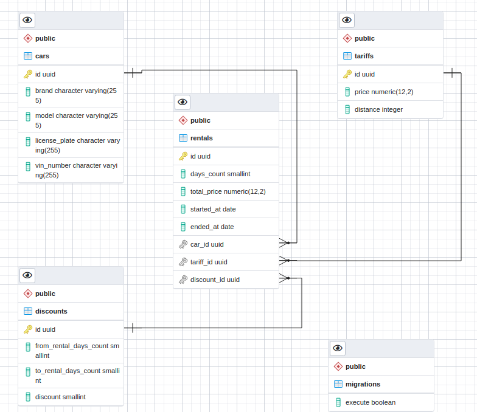

# Car rental

## System requirements

- Node.js 12+ (https://nodejs.org/)
- Yarn 1.22.5+ (https://classic.yarnpkg.com/)
- Docker 19+ (https://www.docker.com/)
- Docker Compose (https://docs.docker.com/compose/)
- PostgreSQL 14 (https://www.postgresql.org/)
- Keycloak 15 (https://www.keycloak.org/)

## Installation

### Node.js

- Linux: https://nodejs.org/en/download/package-manager/
- Windows: https://nodejs.org/en/download/

### Yarn

https://classic.yarnpkg.com/en/docs/install

### Docker

https://docs.docker.com/engine/install/

### Docker Compose

https://docs.docker.com/compose/install/

### Infrastructure services

- PostgreSQL

1. `docker-compose up -d`

## Running the app

1. `yarn`
1. `yarn start:dev`
1. Open http://localhost:3000/swagger-ui

## Environment variables

### user
| Name              | Description            | Default value |
|-------------------|------------------------|---------------|
| NODE_ENV          | environment            | develop       |
| POSTGRES_USER     | database username      | postgres      |
| POSTGRES_PASSWORD | database user password | postgres      |
| POSTGRES_HOST     | database host          | localhost     |
| POSTGRES_PORT     | database port          | 5432          |
| POSTGRES_DB       | database name          | car-rental    |

###ERD Diagram

